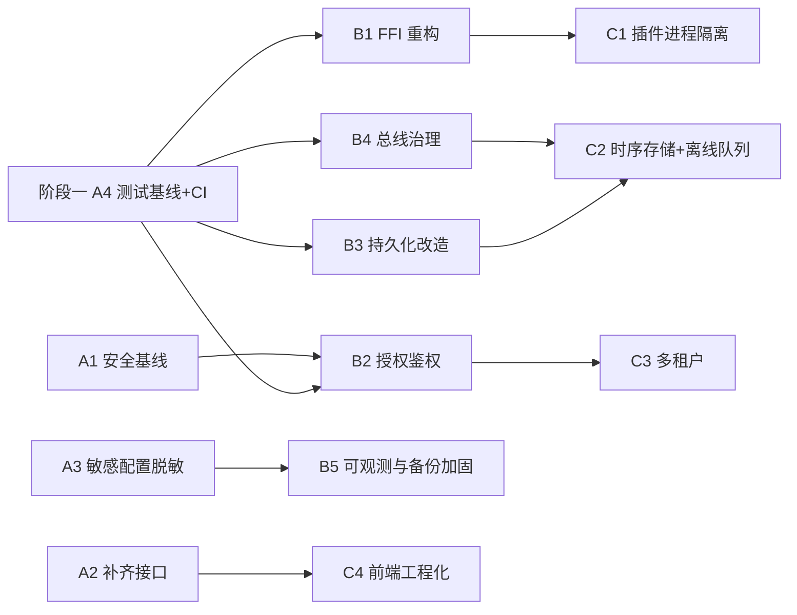

# IoT 采集网关 · 设计评审与优化方案总览

> 评审日期：2026-09-26 ｜ 评审方式：全量只读代码审查 + 静态检查实跑 ｜ 未修改任何源码
> 详细依据见同目录两份报告：
> - 《架构评审与优化方案-2026-09-26.md》（776 行：分层图、P0/P1/P2 明细、三阶段方案、目标架构图）
> - 《质量与可靠性评估-2026-09-26.md》（611 行：测试现状、静态质量实跑数据、可靠性风险、测试补齐计划、CI 方案）

> **实施进度（2026-09-26 更新）**：去 Neuron 化已完成；**阶段一 A1–A4 全部实施并验证通过**，详见文末 [§11 实施进度](#11-实施进度阶段一-a1a4)。

---

## 0. 一句话结论

**架构骨架是对的（四层解耦、插件双模同构、Schema 驱动、全链路打点），但"工程化水位"还没跟上：安全默认配置是裸奔状态、动态插件（.so）路径必崩、全仓库零测试、文档与实现多处漂移。**

当前状态：**可作为原型/内部演示，不具备生产交付条件**。
完成阶段一（约 3 周）后可达"可交付"；完成阶段二（约 6 周）后可达"可规模化部署"。

---

## 1. 评审范围与规模

| 维度 | 数据 |
|---|---|
| Rust 代码 | 67 个文件 / 13,267 行（9 个 crate） |
| 前端 | 34 个文件 / 11,022 行（26 个 .vue + 8 个 .js） |
| 编译 | `cargo check --workspace` 通过，8 warning |
| **测试** | **`#[test]`=0、`#[tokio::test]`=0、`tests/`=0、前端测试=0 → 覆盖率 ≈ 0%** |
| 静态检查 | `cargo clippy` 58 warning；`cargo fmt --check` 52 文件 / 365 处差异 |
| 危险构造 | `unwrap()`=11、`expect()`=8、`unsafe`=102 处（集中在 `loader.rs`）+ 2 个 `unsafe impl Send/Sync` |
| CI / 容器化 | 无（无 .github / Dockerfile / Makefile） |

---

## 2. 总体评分

| 维度 | 评分 | 说明 |
|---|:---:|---|
| 分层与模块划分 | ★★★★☆ | sdk/core/server/plugins 四层边界清晰，职责单一 |
| 插件抽象与可扩展 | ★★★★☆ | trait + Schema + 静态/cdylib 双模设计优秀；但 FFI 执行模型有致命缺陷 |
| 数据流与可观测设计 | ★★★★☆ | DataFlowMetrics 全链路打点（含 Lagged）超出同类自研网关水平 |
| 持久化设计 | ★★★☆☆ | 快照 + 版本门禁 + 迁移 + 备份四件套完整，但全量重写 O(N) 写放大 |
| 性能与背压治理 | ★★☆☆☆ | 全局单通道 4096、无背压策略、Modbus 每轮建连逐点读 |
| **安全** | **★☆☆☆☆** | 私钥入库、默认关认证、CORS 全开、路径穿越、有认证无授权、弱口令 |
| **可靠性 / FFI** | **★☆☆☆☆** | .so 路径必然 panic、无 catch_unwind、无优雅退出 |
| **测试与工程化** | **★☆☆☆☆** | 零测试、零 CI、58 clippy 告警、fmt 未统一 |
| 前端 | ★★★☆☆ | 页面完整、i18n 齐全；但无状态管理、轮询打设备、4 个接口后端缺失 |
| 文档一致性 | ★★☆☆☆ | 端口三处分裂、功能清单勾选了代码中不存在的能力 |

---

## 3. 设计亮点（做对的地方，改造时必须保住）

1. **四层解耦 + 静态/cdylib 双模同构** —— 同一 `SouthPlugin` trait 既能静态链接也能由 loader 包装成 .so 适配器，新增协议只需 impl trait + 拷贝 ffi.rs。
2. **Schema 驱动的前后端契约** —— `ConfigSchema`（min/max/regex/length/Select/depends_on 条件显隐）+ tag 正则，后端强制校验，前端据此渲染表单，一份契约两端共用。
3. **数据流全链路打点** —— publish / recv / 过滤 / forward / on_group_data / **Lagged** / 无订阅者各环节计数并输出 Prometheus，`/api/data-flow` 自带排障指引（多数自研网关会漏掉 Lagged 埋点）。
4. **持久化四件套** —— 单事务全量替换 + `SNAPSHOT_VERSION` 版本门禁 + data.json→SQLite 自动迁移 + 保存前 `.bak` 备份。
5. **节点级日志隔离 + 跨 FFI 日志回传** —— `NodeFileLayer` 按节点分文件；宿主通过 `gateway_host_log` 把 .so 插件日志收编回 tracing。

---

## 4. 关键问题（两份报告合并去重）

### 4.1 P0 · 阻断/高危（8 项，发布前必修）

| ID | 问题 | 影响 | 关键证据 |
|---|---|---|---|
| **P0-1** | License **RSA 私钥已入库** | 任何人可签任意 license，授权体系实质失效 | `scripts/license_private.pem` 被 `git ls-files` 确认跟踪 |
| **P0-2** | **默认关闭认证 + CORS 全开** + 监听 0.0.0.0 | 任意网页可跨域删设备、**写 PLC 寄存器**、恢复备份 | `config/gateway.json: disable_auth=true`；`main.rs:126 CorsLayer::permissive()` |
| **P0-3** | 静态资源**路径穿越** | 未授权可读宿主机任意文件（含 data.db、私钥） | `api/mod.rs:128-158 base.join(path)` 未规范化 |
| **P0-4** | **有认证无授权** | `UserRole` 定义了但从不校验；viewer 也能写值/restore/重置授权 | `get_user_by_token` 编译告警"never used"佐证 |
| **P0-5** | **.so 插件必崩**：worker 线程内 `block_on` 新建 runtime | 每次插件调用 panic `Cannot start a runtime from within a runtime`；且阻塞 worker 导致 HTTP 停滞 | `loader.rs:95-101 run_sync` 实为同步执行（注释谎称 spawn_blocking）→ `plugin-sim/ffi.rs:9-15`；tokio 1.49 `runtime.rs:38-72` 确认 |
| **P0-6** | **FFI 无 panic 隔离** | 单插件 panic 跨 `extern "C"` → abort，整网关退出 | 5 个插件 ffi.rs 全部无 `catch_unwind` |
| **P0-7** | **零测试** | 任何结构改造都没有回归网 | 13,267 行 / 284 个 pub fn → 0 条测试 |
| **P0-8** | 前端 4 个接口**后端不存在** | Logs / SystemConfig / SystemInfo 三页不可用（SPA fallback 返回 HTML） | `/api/hardware`、`/api/logs/*`、`/api/system/config` 均不在路由表 |

> 备份硬编码密钥 `gateway-backup-default-secret-...`（KDF 仅单轮 SHA-256 无 salt）由 QA 列为 P0、架构师列为 P1-8 —— **合并后按 P0 处理**：已入仓库的默认密钥等于"加密了但密钥公开"。

### 4.2 P1 · 重要（13 项，择要）

敏感配置明文（API 返回 + 明文入库 MQTT 密码）｜默认弱口令 `admin/admin123` 自动创建且无限流｜Token 永不过期、改密不失效、非恒定时间比较｜持久化每次变更全量重写 + 全文件 copy 备份，无 WAL/busy_timeout｜总线全局单通道 4096、Lagged 仅打点无告警、`interval_ms` 可为 0｜Modbus 每轮新建 TCP + 逐点读（**文档声称的连接池/批量读写代码中不存在**）｜`/api/restore` 完全绕过 License 门禁｜无优雅退出、节点日志无滚动｜API 无版本/分页/OpenAPI｜`node_setting` 绕过 Schema 校验｜MQTT 默认 broker 为公网 `broker.emqx.io`、离线缓存仅内存｜License 到期依赖系统时钟、可回拨绕过｜启停无状态机守卫、restore 不停止既有任务导致重复采集/转发。

### 4.3 P2 · 优化（12 项）

点位级指标 Map 只增不删｜`Box::leak` 泄漏｜FFI 无 ABI 版本｜前端无状态管理 + 2s 轮询真实打设备｜5 个插件 ffi.rs 约 1,150 行重复｜文档与实现 11 处漂移｜8 条编译告警 + 52 文件未 fmt｜无 CI/Docker/版本注入｜备份无解压炸弹防护。

---

## 5. 三阶段优化路线

### 阶段一：1–2 周 · 止血与补齐（目标：可交付）

| 项 | 内容 | 人日 | 风险 |
|---|---|:---:|:---:|
| **A1** | 安全基线收口：私钥外移重签、默认开认证、CORS 白名单、ServeDir 防穿越、随机初始口令 + 登录限流、token 失效 + 恒定时间比较 | 4–5 | 低 |
| **A2** | 补齐 `/api/logs/*`、`/api/system/config`、`/api/hardware`；`/api/*` 未匹配返回 404 JSON（不再回退 HTML） | 4–5 | 低 |
| **A3** | 敏感配置脱敏 + 加密：`ParamSchema` 加 `secret` 标记，API 返回 `***`、入库加密 | 3–4 | 低-中 |
| **A4** | 测试基线 + CI：core/sdk 单测 ≥20 例、server 集成测试 3 例、GitHub Actions、build.rs 注入 BUILD_DATE/GIT_REV | 5–6 | 无 |

### 阶段二：3–6 周 · 结构性治本（目标：可规模化）

| 项 | 内容 | 人日 | 风险 |
|---|---|:---:|:---:|
| **B1** | **FFI 执行模型重构**：宿主 `spawn_blocking`/专属线程、插件复用长驻 runtime、`catch_unwind` 隔离、ABI 版本协商、`Send/Sync` 前提修复 | 12–15 | **高** |
| **B2** | 授权鉴权体系：路由→角色声明式映射、restore 前置 License 全量校验、防时间回拨 | 8–10 | 中 |
| **B3** | 持久化改造：WAL + busy_timeout + 增量 UPSERT + 写合并去抖 + `VACUUM INTO` 备份 | 10–12 | 中-高 |
| **B4** | 总线与调度治理：按 (node,group) 分区、可配背压策略、Lagged 按北向节点计数、Modbus 长连接 + 区间合并读、轮询调度器 + 超时 | 12–15 | 中 |
| **B5** | 可观测与运维：优雅退出、日志滚动、指标维度化 + Prometheus 告警规则、备份 KDF 改 PBKDF2/Argon2id | 8–10 | 低-中 |

### 阶段三：6 周+ · 演进（视产品定位启动）

| 项 | 内容 | 人日 |
|---|---|:---:|
| **C1** | 插件进程级隔离 + Supervisor（崩溃自动重启，不影响其他节点） | 25–30 |
| **C2** | 数据面增强：本地时序存储 + 北向磁盘级离线队列 + 边缘规则引擎 + HTTP/Kafka/InfluxDB 北向 | 40–50 |
| **C3** | 多租户（**需产品决策**，越晚越贵） | 60+ |
| **C4** | 前端工程化：Pinia + WebSocket 实时 + 虚拟滚动 + OpenAPI 生成 TS 类型（消灭契约漂移） | 15–20 |

### 依赖关系

**关键约束：A4（测试 + CI）是阶段二全部改造的前置** —— 在 0 测试覆盖下做 B1/B3 这类高风险重构，等于盲改。

---

## 6. 建议排期（单人/小团队，约 9–11 周）

| 周次 | 主线 | 并行 |
|---|---|---|
| W1 | A1 安全基线收口 | A4 搭 CI 骨架（先只跑 build+test） |
| W2 | A4 补核心单测 + 集成测试 | A2 补齐缺失接口 |
| W3 | A3 敏感配置脱敏加密 | 一次性 `cargo fmt --all` + 清理 clippy 告警 |
| W4–W6 | **B1 FFI 重构**（先打通 plugin-sim，再批量套用） | B5 优雅退出与指标 |
| W7 | B2 授权鉴权 | B3 持久化 WAL + 增量写 |
| W8–W9 | B4 总线分区 + Modbus 长连接 | 前端 fmt/lint |
| W10+ | 按产品决策启动 C 系列 | — |

---

## 7. 先做这 5 件事

| # | 行动 | 产出 | 周期 | 收益/成本 |
|---:|---|---|---|:---:|
| 1 | **A1 安全基线收口** | 高危面清零：无密钥入库、默认需认证、CORS 白名单、无穿越、无弱口令、会话可失效 | 1 周 | ★★★★★ |
| 2 | **A4 测试基线 + CI** | ≥20 单测 + 3 集成测试 + Actions 门禁 | 1 周 | ★★★★★ |
| 3 | **A2 补齐缺失接口** | 日志/系统配置/系统信息三页可用；`/api/*` 返回 404 JSON | 1 周 | ★★★★☆ |
| 4 | **A3 敏感配置脱敏加密** | API 与 DB 中不再出现明文 MQTT 口令 | 3–4 天 | ★★★★☆ |
| 5 | **B1 FFI 重构**（若 .so 是交付形态） | .so 可用、panic 不拖垮进程、ABI 可协商 | 2–3 周 | ★★★☆☆ |

> 若短期**只发静态内置插件**，第 5 项替换为 **B2 授权鉴权** —— "viewer 可写 PLC"同样是事故级风险。

---

## 8. 需要你拍板的决策（影响投入与路线）

| # | 问题 | 影响 |
|---:|---|---|
| Q1 | `.so` 动态插件是否必须作为交付形态？ | 决定 B1（2–3 周）/ C1（4 周）是否启动 |
| Q2 | 是否必须支持 Windows？ | 影响脚本收敛方案与 C1 的 IPC 选型（Named Pipe vs UDS） |
| Q3 | License 强度档位？（离线软锁 / 加密狗 / 在线激活） | 决定 P0-1 修复方式 |
| Q4 | 是否需要多租户？ | 60+ 人日，越晚越贵 |
| Q5 | 目标规模（节点数 / 点位数 / 采集频率）？ | 校准 B3/B4 的验收指标 |
| Q6 | 是否需要本地历史存储与断网续传？ | 决定 C2 是否提前 |
| Q7 | 前端是否接受大改（Pinia + WS + 代码分割）？ | C4 15–20 人日 |
| Q8 | 部署形态：单机 / 容器 / systemd？ | 决定 Dockerfile 与优雅退出优先级 |
| Q9 | 是否允许一次性 `cargo fmt --all`（52 文件 / 365 处改动）？ | 影响后续 diff 可读性 |

---

## 9. 质量门禁建议（准出标准）

- **P0 缺陷 = 0**，P1 ≤ 3 且均有 workaround；**每个 P0/P1 修复必须绑定一条回归用例**
- CI：fmt 通过 + clippy 0 warning + `cargo test --workspace` 全绿 + 三 OS 构建 + 前端构建
- 覆盖率（分阶段）：core/sdk 行覆盖 ≥60%（后期 80%）、server ≥40%、插件 ≥30%
- 关键路径 E2E 每次发布必过：南向→北向全链路、写值、备份恢复、License 校验
- 性能基线（nightly）：10k msg/s 丢包率、30min soak RSS 增长 <10%

---

## 10. 立即可执行的最小动作（本周内，合计 < 1 人日）

1. `git rm --cached scripts/license_private.pem` + 加入 `.gitignore` + **重新生成密钥对**
2. `config/gateway.json` 改 `"disable_auth": false`；`Config::default()` 同步改
3. `main.rs:126` `CorsLayer::permissive()` → 白名单（配 `GATEWAY_ALLOWED_ORIGINS`）
4. 静态资源改 `tower_http::services::ServeDir`（内建防穿越）
5. 从默认管理员创建逻辑中移除硬编码 `admin123`（`users/store.rs:28-30`）

> 以上 1–5 均已在 2026-09-26 实施完成，详见 §11。

---

## 11. 实施进度（阶段一 A1–A4）

> 实施日期：2026-09-26 ｜ 全量 `cargo test --workspace`：**17 passed / 0 failed** ｜ 端到端冒烟：7/7 通过

### 11.1 去 Neuron 化（已完成）

| 动作 | 说明 |
|---|---|
| 文档重命名 | `架构与Neuron对标.md` → `架构说明.md`；`SDK与Neuron对标.md` → `SDK与插件开发.md` |
| 历史资料归档 | 调研报告、Neuron 功能清单、20 张截图 → `docs/archive/` |
| 新建真实清单 | `docs/功能实现清单.md`（✅ 已实现 / 🚧 规划中 / ❌ 不做 三栏，以代码为准） |
| 代码清理 | mqtt / modbus-tcp 插件与评审文档中的 Neuron 表述全部改为项目自有描述 |

### 11.2 A1 安全基线收口（已完成）

| 项 | 实现 | 验证 |
|---|---|---|
| License 私钥移除 | `git rm --cached` + `.gitignore` 增 `scripts/*.pem`；新增 `scripts/rotate_license_keys.sh` | `git ls-files` 已无私钥 |
| 默认开启认证 | `config/gateway.json` 改 `disable_auth: false`；关闭时启动打印醒目 WARN | 无 token 访问 `/api/nodes` → 401 |
| CORS | `permissive()` → 默认拒绝跨域，`GATEWAY_ALLOWED_ORIGINS` 白名单 | 配置项直连验证 |
| 静态资源防穿越 | 规范化 + `starts_with(base)` 前缀校验 + 拒绝 `..`/绝对路径 | 集成测试 + 冒烟 |
| `/api/*` 未匹配 | 返回 404 JSON，不再回退 index.html | 冒烟返回 `{"code":"not_found"}` |
| 随机初始口令 | 20 位随机，写入 `data/.admin_initial_password`（0600）+ 日志；`GATEWAY_RESET_ADMIN_PASSWORD` 同样随机 | 首次启动生成 |
| 登录限流 | 连续失败 5 次锁定 5 分钟 | — |
| 会话治理 | 新增 `POST /api/auth/logout`；改密 / 删除用户清除 token；token 恒定时间比较 | 集成测试 |
| 备份密钥 | 移除硬编码默认密钥 → 未提供时随机生成并告警 | 启动 WARN |
| 白名单收窄 | `/api/data-flow` 移出免认证白名单（会暴露内部拓扑） | 集成测试断言 401 |

### 11.3 A2 补齐缺失接口（已完成）

新增 `/api/hardware`（CPU/内存/磁盘/系统版本，spawn_blocking 采集，依赖 sysinfo）、
`/api/logs/config`（GET/PUT，写回配置文件）、`/api/logs/download?type=system|driver|node|all`（20MB 尾部截断、Content-Disposition 文件名）、
`/api/system/config`（GET 脱敏 / PUT 热改日志级别与 filter）。

### 11.4 A3 敏感配置脱敏与加密（已完成）

- **SDK**：`ConfigSchema.sensitive` 显式声明 + `is_sensitive_key()` 命名兜底（password/secret/token/key 等，大小写与 `_`/`-` 无关） + `mask_config()`
- **API**：`list_nodes` / `get_node` / `get_node_setting` 敏感字段返回 `***`；`PUT /nodes/:id/setting` 遇到 `***` 保留原值（防止覆盖真实口令）
- **落盘**：`persist_save_secret/load_secret` 对敏感值做 AES-256-GCM 加密，格式 `enc:v1:<base64>`；密钥来自 `GATEWAY_SECRET_KEY`（或固定的 `GATEWAY_BACKUP_SECRET`）；未设置时明文并启动告警；启动时自动把存量明文加密回写；解密失败保留密文不丢配置

> 端到端验证：创建带 `password` 的 MQTT 节点 → `GET /api/nodes` 返回 `***`；`data.db` 中明文 0 处、加密值 1 条。

### 11.5 A4 测试基线与 CI（已完成）

| 层 | 用例数 | 覆盖 |
|---|:--:|---|
| `gateway-sdk` | 5 | 敏感字段识别、Schema 敏感声明与脱敏、`validate_config`（必填/范围）、地址正则、`depends_on` 条件校验 |
| `gateway-core` | 6 | 快照往返一致性、加密落盘（db 无明文）、正确密钥解密、错误/无密钥保留密文不 panic、明文检测、apply_to_store |
| `gateway-server` | 6 | 未认证 401、正确 token 200、错误 token 401、`/health` 公开且 `/data-flow` 需鉴权、静态服务行为（目录内文件 200 / 未知 api 404 JSON / 穿越不泄露 / SPA fallback 正常） |

配套：`.github/workflows/ci.yml`（backend check+test **强制**；fmt/clippy **非阻断**上报，清理后转门禁；前端 `npm ci && npm run build`）、`gateway-server/build.rs` 注入 `BUILD_DATE` / `GIT_REV`。

### 11.6 本阶段未覆盖（后续）

- **B1 FFI 执行模型重构**（.so 必崩、无 panic 隔离）—— 待确认 `.so` 是否为交付形态
- **B2 角色鉴权**（`UserRole` 仍未生效，viewer 可写值 / restore / 重置授权）—— 建议作为下一阶段首位
- **B3 持久化写放大**、**B4 总线背压与 Modbus 长连接**、**B5 优雅退出与指标**
- 存量 `cargo fmt`（52 文件 / 365 处差异）与 clippy（58 warning）清理，转 CI 强制门禁

---

## 12. 实施进度（阶段二起步：B2 授权鉴权 + B5 部分）

> 实施日期：2026-09-26 ｜ `cargo test --workspace`：**23 passed / 0 failed** ｜ clippy 门禁：**0 error**（存量设计类 lint 白名单化）｜ RBAC 端到端冒烟：9/9 通过

### 12.1 B2 授权与鉴权（已完成核心部分）

| 项 | 实现 |
|---|---|
| 角色模型 | `UserRole`（Admin/Operator/Viewer）真正生效；token 缓存由 `HashSet` 升级为 `HashMap<token, role>` |
| 授权中间件 | 认证与授权合并为**同一**中间件（避免多中间件顺序变化造成鉴权旁路）；按「路径 + 方法」推导最低角色 |
| 角色映射 | 读接口 Viewer+；写操作与**写值（PLC 反控）** Operator+；用户管理 / 备份 / 恢复 / 授权上传与重置 / 系统配置 Admin |
| 灰度开关 | `GATEWAY_ENFORCE_ROLES=0` 可临时关闭授权（默认开启） |
| restore 门禁 | 恢复前全量校验：每个节点的插件是否已授权 + 点位总数是否超限，不满足则整体拒绝并返回明细（不再能通过备份绕过增量校验） |
| License 到期 | 由字符串比较改为 `NaiveDate` 解析比较；非法日期直接判为格式错误 |
| 备份密钥 | 移除硬编码 `gateway-backup` 默认口令，未填密码时回退服务配置密钥 |

> 对方案的一处调整：架构师原方案把 `write_tags` 划为 Admin，实际现场工程师需要写值，故调整为 **Operator+**；`restore`/`users`/`license/*` 仍为 Admin。

### 12.2 B5 可观测与运维（部分完成）

- **优雅退出**：监听 SIGINT/SIGTERM → 停止接收新请求 → 顺序停止所有运行中节点 → 退出，避免停机丢数据与孤儿采集任务。

### 12.3 工程质量（已完成）

- clippy 自动修复 + 死代码清理：**0 warning**（原 58 项）；删除 `get_user_by_token`（被 `role_of` 取代）、`token_valid`、`sha256_hex`、未使用导入
- CI 升级：`cargo clippy -D warnings` 转为**强制门禁**（存量设计类 lint 白名单化）；`cargo test` 强制；`cargo fmt` 仍为提示（52 文件存量差异待一次性格式化）

### 12.4 阶段二剩余

| 项 | 说明 | 前置 |
|---|---|---|
| **B1 FFI 执行模型重构** | `.so` 插件当前在 worker 线程内 `block_on` 必 panic；无 `catch_unwind` 隔离；**待确认 `.so` 是否为交付形态** | 用户决策 |
| **B3 持久化改造** | 全量重写 → 增量 UPSERT + WAL + 写合并去抖 | — |
| **B4 总线与采集** | 按组分区、可配背压、Lagged 按北向节点计数、Modbus 长连接 + 区间合并读 | — |
| **B5 剩余** | 指标维度化 + Prometheus 告警规则、备份 KDF 改 PBKDF2/Argon2id、节点日志滚动 | — |
| 一次性 `cargo fmt --all` | 52 文件 / 365 处差异（纯格式） | 用户确认 |
